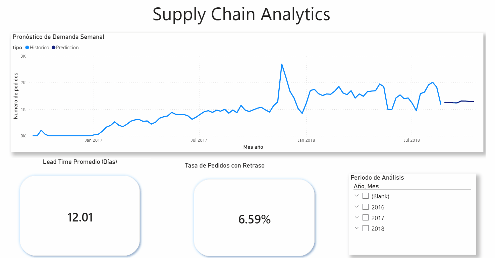

# Supply Chain 360: Predictive Analytics and Logistics Optimization


## Project Overview
This project delivers an end-to-end data engineering and analytics solution for Olist, a Brazilian e-commerce platform. The objective is to mitigate supply chain inefficiencies by integrating cloud-based data warehousing, statistical demand forecasting, and business intelligence.

By analyzing over 100,000 historical records, this solution provides a robust mechanism to monitor logistical performance and predict future inventory requirements, bridging the gap between raw operational data and strategic decision-making.

---

## Dashboard Preview
The following demonstration highlights the dashboard's interactivity, including dynamic filtering by fiscal year and the visualization of the 8-week demand forecast generated by the Python model.



| Artifact | Access Link |
| :--- | :--- |
| **Interactive Report (Source)** | [Download .pbix File](dashboard/Suplly%20Chain%20Report.pbix) |
| **Forecasting Model (Code)** | [Open in Google Colab](https://colab.research.google.com/drive/1gqIQ1NoH987uEw8tFE0cxMl08DBkBJVK#scrollTo=5BhZcKj5A9r1) |

---

## Business Context and Strategic Value

### The Challenge
In the e-commerce sector, demand volatility and logistical bottlenecks directly impact customer satisfaction and operational costs. Olist faced challenges in tracking precise delivery timelines and anticipating weekly order volumes, leading to potential stockouts or overstocking scenarios.

### The Solution
We implemented a **Predictive Supply Chain Monitor** that serves two primary organizational functions:
1.  **Operational Transparency:** Real-time tracking of Lead Times and Delivery Delays allows logistics managers to identify underperforming carriers or routes.
2.  **Proactive Planning:** By forecasting demand 8 weeks in advance, the procurement team can transition from reactive "firefighting" to proactive inventory management.

### Key Performance Indicators (KPIs)
* **Average Lead Time:** 12.01 Days (Purchase to Delivery).
* **Late Delivery Rate:** 6.59% of total orders.
* **Forecast Horizon:** 8 Weeks (Weekly aggregation).

### Organizational Impact
From an **Organizational Psychology** perspective, this tool is designed to reduce cognitive load and operational stress on the logistics team. By providing predictable metrics and clear foresight, the organization can level the workload, preventing burnout associated with unexpected demand surges.

---

## Technical Architecture and Implementation

The project follows a modern ELT (Extract, Load, Transform) pipeline architecture, leveraging the scalability of Google Cloud Platform and the analytical power of Python.

### 1. Data Engineering (Google Cloud Platform)
* **Data Lake:** Utilized Google Cloud Storage (GCS) buckets to stage raw CSV datasets from the Olist public dataset.
* **Data Warehouse (BigQuery):**
    * Ingested raw data into BigQuery tables.
    * Developed SQL scripts to clean data, handle NULL values, and calculate calculated fields such as `shipping_limit_date` vs. `delivery_date`.
    * Created aggregated views for the Python model (`data_forecast_semanal`) to optimize query performance and reduce latency.
* **Artifacts:** `sql/query.sql`

### 2. Data Science (Python & Statsmodels)
* **Time Series Analysis:** Extracted weekly sales data from BigQuery using the `google-cloud-bigquery` client.
* **Preprocessing:** Implemented resampling techniques (`resample('W-MON')`) to normalize the time series frequency and handled missing periods with zero-filling to ensure mathematical continuity.
* **Modeling:** Applied the **Holt-Winters Exponential Smoothing** algorithm.
    * **Trend Component:** Additive (to capture long-term growth).
    * **Seasonal Component:** Additive with a period of 4 (to capture monthly buying cycles).
* **Artifacts:** `notebooks/Project_Suplain_Chain.ipynb`

### 3. Business Intelligence (Power BI)
* **Data Modeling:** Designed a Star Schema architecture to facilitate efficient filtering and aggregation.
* **Cloud Connectivity:** Used Power Query (M Language) to establish a direct connection to BigQuery for historical data and integrated local CSV outputs for the forecast results.
* **DAX Measures:** Developed dynamic measures for `Average Freight Cost`, `On-Time Delivery Rate`, and `Total Orders` to support interactive drill-down analysis.
* **Artifacts:** `dashboard/Suplly Chain Report.pbix`

---

## Repository Structure

```text
├── dashboard/          # Power BI Report (.pbix) and static assets (GIF/Images)
├── data/               # Processed datasets (CSV) ensuring project reproducibility
│   ├── forecast_resultados.csv
│   └── hechos_logistica.csv
├── notebooks/          # Jupyter Notebook containing the Holt-Winters model
├── sql/                # SQL Scripts used for BigQuery transformations
├── etl/                # Documentation for Power Query/M connections
└── requirements.txt    # Python environment dependencies
